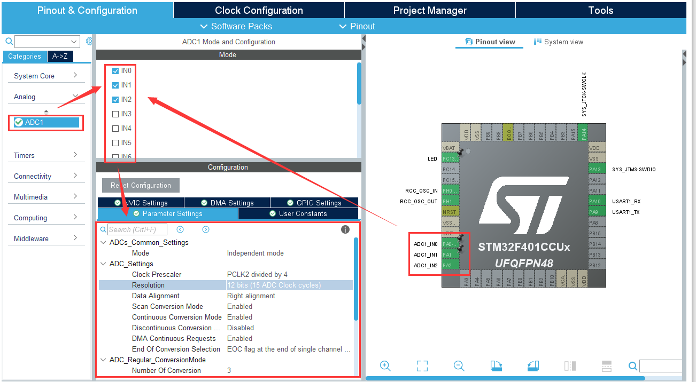
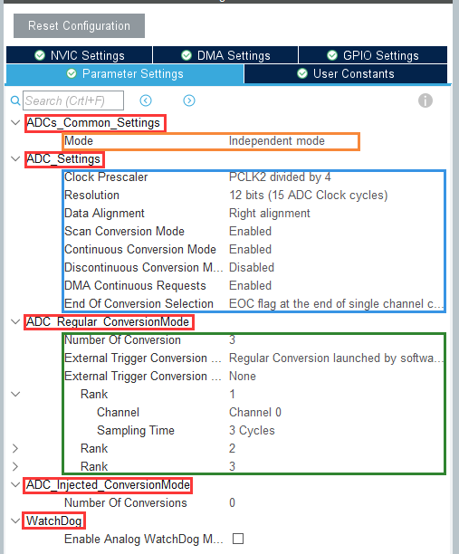
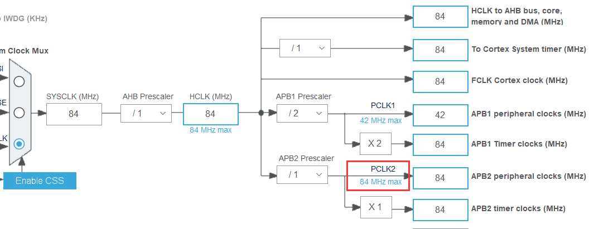
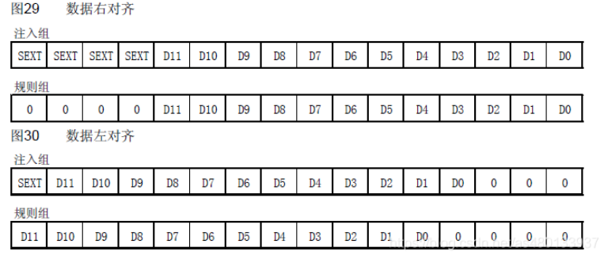
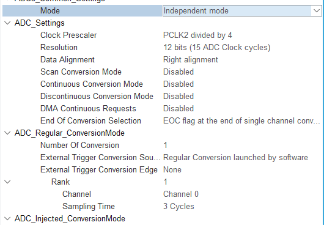
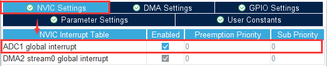
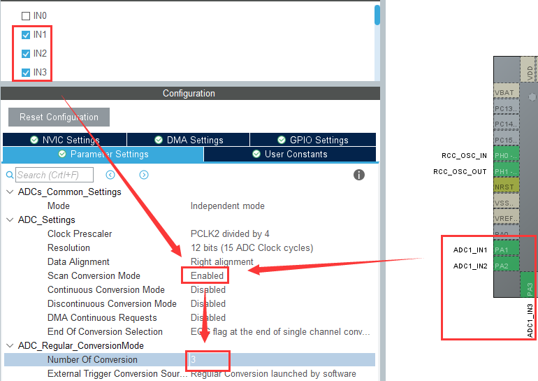

ADC参数配置可以在左侧**Analog**打开固定的通道引脚，或者先从芯片上选择ADC功能后查看，：

#基本参数介绍

以F401为例，我们分级看看ADC都有那些参数可以配置：

##主要参数分类

| 参数名                      | 说明                                            |
| --------------------------- | ----------------------------------------------- |
| ADCs_Common_Settings        | 模式设置：可以设置为独立工作或多个ADC的多重采样 |
| ADC_Settings                | 基本设置：主要参数的设置                        |
| ADC_Regular_ConversionMode  | 规则通道设置：多通道采集时使用                  |
| ADC_Injected_ConversionMode | 注入通道设置：一样是多个通道时使用              |
| WatchDog                    | 看门狗：测量值不在范围内使用，防止系统出错      |

##基本设置

- **Clock Prescaler**：ADC时钟的分频数

查看[数据手册](https://atta.szlcsc.com/upload/public/pdf/source/20160816/1471343009422.pdf)的14页，F401的ADC挂在APB2下，这里设置为PCLK2时钟下的四分频，其中PCLK2可以在时钟树里看到：

可以通过调整分频数来设置不同的ADC时钟周期，这里设置为4分频，21MHz

- **Resolution**：ADC分辨率，高精度时可以选择最高的12bit，转换周期较长

- **Data Alignment**：对齐方式

ADC转换的寄存器为16位的寄存器，而我们最多使用12bit，因此可以设置12bit数据在16bit寄存器中靠哪一边对齐：

默认我们使用右对齐模式

- **Scan Conversion Mode**：扫描转换模式

使用多个通道ADC输入时使能扫描模式

- **Continuous Conversion Mode**：连续转换模式

设置为ENABLE，即连续转换。如果设置为DISABLE，则是**单次转换**。两者的区别在于连续转换直到所有的数据转换完成后才停止转换，而单次转换则只转换一次数据就停止，要再次触发转换才可以进行转换

- **Discontinuous Conversion Mode**：间断转换模式

多个ADC一起采集时使用，我们只有一个ADC，不使能

- **DMA Continuous Requests**：DMA转换请求

使用DMA自动转换时使能

- **End of Conversion Selection**：转换结束的选择

选择什么时候结束转换，是单次还是序列

##规则通道设置

- **Number Of Conversion**：转换的（通道）数目

多通道采样时设置自己需要的通道数，设置此项后Rank才可用

- **External Trigger Conversion Source**：外部触发转换源

ADC的转换开始信号可以由软件程序开始，或者定时器的输入捕获通道

- **External Trigger Conversion Edge**：外部触发边沿

开始信号设置为定时器的输入捕获时可以设置其边沿类型

- **Rank**：转换顺序

配置多个不同通道的转换顺序，以及其采样时间

##注入通道设置

和规则通道一样，这里不再描述

##看门狗

测量值超出测量范围或者低于最低范围，启动看门狗

[]后续补充看门狗教程

#不同模式配置示例

##单通道的一般模式

最简单的单通道使用时不用做什么配置，保持默认的配置即可：

##中断配置

ADC的中断配置也很简单，代码在后续小章节

##多通道的配置

多通道的配置相对麻烦，需要先打开多个ADC引脚，再配置规则通道的数目，最后配置具体的各等级通道：

在配置Number Of Conversion的数目后才可以看到多个Rank

#教程调转

##CSDN上的教程

- Z小璇：https://blog.csdn.net/as480133937/article/details/99627062
- Mculover666：https://mculover666.blog.csdn.net/article/details/102871385

##基地内部教程

- [查询阻塞方式](查询阻塞方式.md)

- [中断方式](中断方式.md)

- [DMA方式](DMA方式.md)
