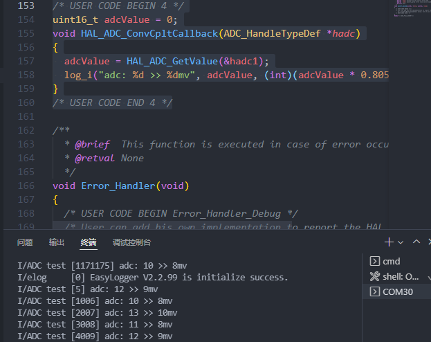

#单通道ADC

阻塞模式的ADC不是很好用，需要我们在循环中一直调用`HAL_ADC_PollForConversion`等函数进行等待和判断是否完成ADC转换，其大致的流程为：开始一次ADC→等待转换结束→判断是否成功→读取值，这样一类主进程会顿一小会。**而使用中断方式的话**：主进程开始转换→中断中读取值，可以看到用中断的方式会方便很多，而本章节会介绍该方法：

##单通道采集CubeMX配置

同样是在完成格式化输出的工程基础上打开ADC，这里对串口的格式化输出不在赘述，而ADC的中断配置方法如下：

基础的配置参考阻塞方式的方法，配置PA0为ADC1的通道0，默认配置


之后打开ADC的中断即可：


##单通道代码编写

主函数在完成格式化输出的基础上，在while(1)每隔一段时间调用一次开始ADC转换:

```c
    HAL_ADC_Start_IT(&hadc1);
    HAL_Delay(1000);
```

我们可以试着在主函数中敲一下`hal_adc_call`来查看有哪些回调函数：


| 函数名                    | 含义                            |
| ------------------------- | ------------------------------- |
| ErrorCallback             | ADC转换**错误时**的回调函数     |
| ConvCpltCallback          | ADC转换**完成时**的回调函数     |
| ConvHalfCpltCallback      | ADC转换**过半时**的回调函数     |
| LevelOutOfWindowsCallback | ADC转换**超出范围时**的回调函数 |

这里我们使用**完成时**的回调函数，在`main.c` 的下方编写如下函数：

```c
/* USER CODE BEGIN 4 */
uint16_t adcValue = 0;
void HAL_ADC_ConvCpltCallback(ADC_HandleTypeDef *hadc)
{
  adcValue = HAL_ADC_GetValue(&hadc1);
  log_i("adc: %d >> %dmv", adcValue, (int)(adcValue * 0.805));
}
/* USER CODE END 4 */
```

编译下载后能看到如下效果：




#多通道的ADC

##多通道采集CubeMX配置

多通道时同样和阻塞方式类似，配置时需要打开扫描模式：


配置各个等级对应的通道：


##多通道代码编写

while(1) 里和单通道的编写方式一样，定时打开ADC转换即可：

```c
HAL_ADC_Start_IT(&hadc1);
HAL_Delay(1000);
```

而回调函数中需要自己打开多次转换，以下代码仅供参考，因设备有限暂时验证不了多通道ADC的准确性：

```c
/* USER CODE BEGIN 4 */
uint16_t adcValue[3] = {0};
void HAL_ADC_ConvCpltCallback(ADC_HandleTypeDef *hadc)
{
  static uint8_t channel = 0;
  adcValue[channel] = HAL_ADC_GetValue(&hadc1);
  log_i("adc%d: %d >> %dmv", channel, adcValue[channel], (int)(adcValue[channel] * 0.805));
  channel++;
  if(channel >= 3)
  {
    channel = 0;
    log_i("complete\n\n");
  }
  else HAL_ADC_Start_IT(&hadc1);
}
/* USER CODE END 4 */
```

测试结果如下：

