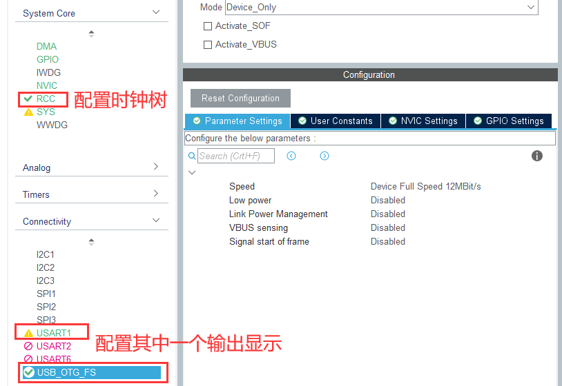
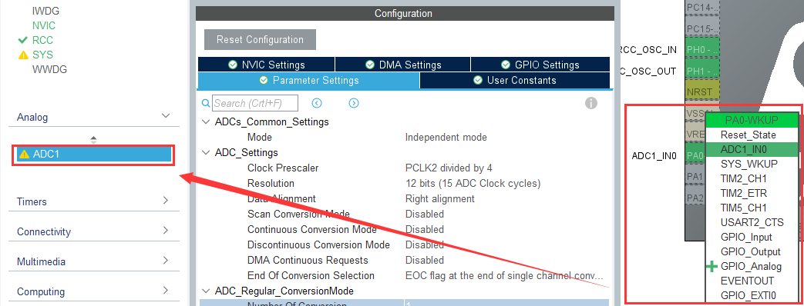
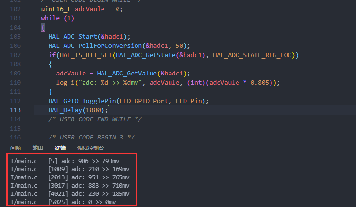
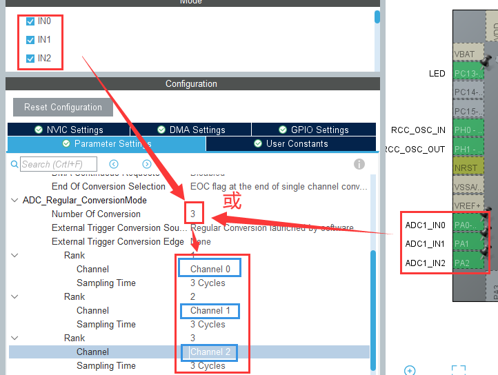

# 单通道的ADC采集

发给大家的F401小板子上的PA0 (ADC1_IN0)连接着一个三向拨动按键，这个按键接了几个电阻分压可以模拟量的输入测试IO，本章我们试着实现ADC按键功能 

## 单通道时CubeMX的配置
 
在完成[格式化输出](./STM32串口/格式化输出.md)的基础上开始这次的工程，我这里使用串口1和elog日志方式输出，当然，使用USB的虚拟串口甚至OLED显示也可以：



接着选择PA0作为ADC1_IN0通道输入，ADC参数配置保持默认即可：



## 代码编写

代码首先配置好格式化输出显示，这里不再说明

之后定义一个16位的变量，用于存放采集到的ADC数值，主函数编写如下代码：

```c
  /* USER CODE BEGIN WHILE */
  uint16_t adcVaule = 0;
  while (1)
  {
    HAL_ADC_Start(&hadc1);
    HAL_ADC_PollForConversion(&hadc1, 50);
    if(HAL_IS_BIT_SET(HAL_ADC_GetState(&hadc1), HAL_ADC_STATE_REG_EOC))
    {
      adcVaule = HAL_ADC_GetValue(&hadc1);
      log_i("adc: %d >> %dmv", adcVaule, (int)(adcVaule * 0.805));
    }
    HAL_GPIO_TogglePin(LED_GPIO_Port, LED_Pin);
    HAL_Delay(1000);
    /* USER CODE END WHILE */
```

编译、下载后查看效果：




# 多通道的ADC采集

## 多通道时的CubeMX配置

首先打开多个ADC输入引脚，这里以打开IN0、IN1、IN2为例，打开后设置规则通道为三个，逐一配置转换的等级：



**这里需要注意：**

一个ADC下的多个通道是不能同时开始采集的，而是按照我们设置的等级逐个进行，比如着了设置的是依次从Channel 0到Channel 2，对应的具体引脚为PA0~PA2，程序上也是多个通道的依次采集，需要等待多次，如下

## 代码编写

```c
 /* USER CODE BEGIN WHILE */
  uint16_t adcVaule[3] = {0};
  while (1)
  {

    for (int i = 0; i < 3; i++)
    {
      HAL_ADC_Start(&hadc1);
      HAL_ADC_PollForConversion(&hadc1, 50);
      if (HAL_IS_BIT_SET(HAL_ADC_GetState(&hadc1), HAL_ADC_STATE_REG_EOC))
      {
        adcVaule[i] = HAL_ADC_GetValue(&hadc1);
        log_i("adc%d: %d >> %dmv", i, adcVaule[i], (int)(adcVaule[i] * 0.805));
      }
    }
    log_i("\n\n");
    HAL_GPIO_TogglePin(LED_GPIO_Port, LED_Pin);
    HAL_Delay(1000);
    /* USER CODE END WHILE */

```

下载成功后的效果如下：


