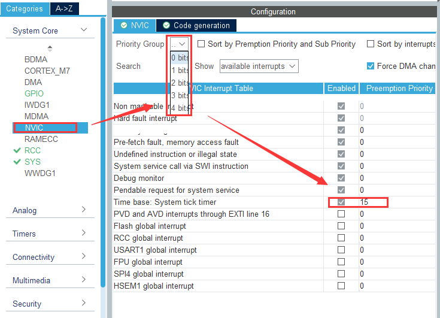
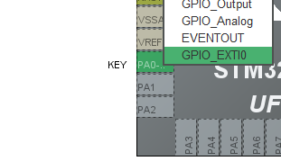
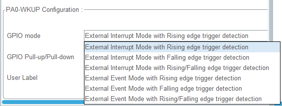
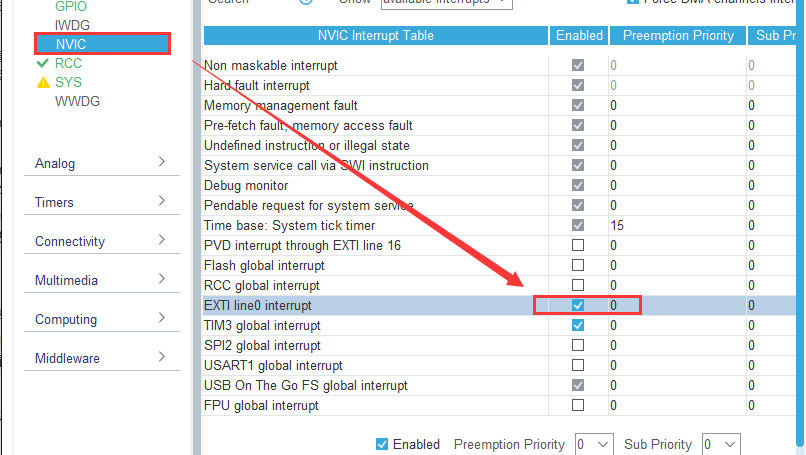

# CubeMX 中的优先级配置
在 System Core：NVIC 中可以对优先级分组以及已有优先级进行可视化管理：

可以看到上图中选择的4bit全用于分配组员，即[0:4]，优先级分配情况为1级抢占优先级，16级子优先级

# STM32外部中断的使用

## CubeMX中的配置

通常外部中断是用于按键或者其他外设模块的中断申请，以作为一个输入的IO口，我们以上节课按键用的IO口PA0为例，配置其为外部中断功能：

可以看到其为外部中断0，接着到GPIO中配置其触发方式，触发方式有一下几种：

|       外部中断       |       触发事件       |
| :------------------: | :------------------: |
| 1 上升沿触发外部中断 | 4 上升沿触发外部事件 |
| 2 下降沿触发外部中断 | 5 下降沿触发外部事件 |
|   3 双边沿触发中断   | 6 双边沿触发外部事件 |

因为PA0上的按键是按下后高电平，我们选择上升沿触发外部中断，之后配置NVIC，打开相应中断：

之后参照第一次讲课，打开LED添加相应 `LedTick()` 函数作为指示灯。