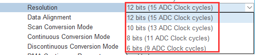
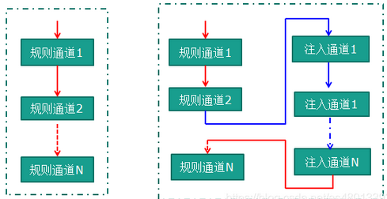
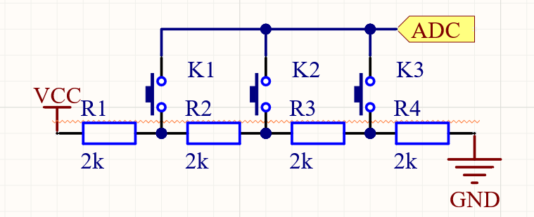

<h1 class="article-title">ADC的使用</h1>

#ADC简介

>本章参考文章：https://blog.csdn.net/as480133937/article/details/99627062

##什么是ADC

ADC是**Analog-to-Digital Converter**的缩写，指模拟/数字转换器，是指将连续变量的**模拟信号**转换为离散的**数字信号**的器件。在实际应用中，很多的信号或者参数并不都是通过协议读取到的**数字量**,而是大自然存在广泛的**模拟量**。例如一个IO的电平以数字角度可以简单地以高电平的1或者低电平的0标识，但是它真实电压是飘忽不定的，不能直接用0和1表示，高电平的1实际上对应着范围内的**无限个连续的模拟电压**

由此，我们需要把模拟的电压转换为程序中可以直接使用的数字量，比如我们可以把0-3.3V进行1000细分，那么一份是3.3mv，这时我们可以用一个整数500表示目前IO口上的电压为1.65V。当然我们可以加大细分，以提高ADC的精度，不过除了精度我们也得考虑完成一次转换需要多久的时间，等等。这些便是ADC的关键指标

##ADC的几个关键词

- **电压输入范围**

**ADC一般用于采集小电压，其输入值不能超过VDDA**，即ADC输入范围：VREF- ≤ VIN ≤ VREF+。
**一般把VSSA和VREF- 接地， VREF+ 和 VDDA接3V3，那么ADC的输入范围是0~3.3V**，部分芯片没有VERF引脚（如我们的F401CD），这时候的VERF取VDDA的值，为了ADC的准确性，可以给VERF引脚接上电压基准芯片

- **分辨率**

不同的ADC芯片的ADC转换分辨率不同，而STM32F401内部的ADC转换器最大支持12bit分辨率的ADC，部分其他芯片可以到14bit。以12bit为例，合计的分辨率是0~4095共4096级，如果此时的基准电压使用电源电压3.3V，那么一个分度级是3300/4096 = 0.806mv

- **转换时间**

一般来说，ADC的分辨率越高需要更多的转换时间，在CubeMX配置时可以看到不同的分辨率需要多少个ADC的时钟周期：

在实际应用中需要权衡分辨率和速度

- **转换模式**

1 单次转换模式：ADC只执行一次转换

2 连续转换模式：转换结束之后马上开始新的转换

3 扫描模式：ADC扫描被规则通道和注入通道选中的所有通道，在每个组的每个通道上执行单次转换。在每个转换结束时，这一组的下一个通道被自动转换。如果设置了CONT位（开启了连续 转换模式），转换不会在选择组的最后一个通道上停止，而是再次从选择组的第一个通道继续转换

4 间断模式：触发一次，转换一个通道，在触发，在转换。在所选转换通道循环，由触发信号启动新一轮的转换，直到转换完成为止

扫描模式简单的说是一次对所有所选中的通道进行转换，比如开了ch0，ch1，ch4，ch5。  ch0转换完以后就会自动转换通道1,4,5直到转换完这个过程不能被打断。如果开启了连续转换模式，则会在转换完ch5之后开始新一轮的转换

- **输入通道**

STM32上的ADC数量有限，一般不超过3个，为了满足多路ADC采集的需求，每个ADC都会挂在复数的通道，可以依次采集多路电压

- **规则通道、注入通道**

规则通道相当于你正常运行的程序，看它的名字就可以知道，很规矩，就是正常执行程序。而注入通道可以打断规则通道，听它的名字就知道不安分，如果在规则通道转换过程中，**有注入通道进行转换，那么就要先转换完注入通道，等注入通道转换完成后，再回到规则通道的转换流程**，类似中断程序：

##相应计算

计算主要是把采集到的模拟电压计算出原本的模拟电压，以12bit的ADC分辨率距离，假设采集到的ADC值为1500，计算方法为：1500*3300/4096 = 1208mv，及设采集到的ADC值为adcVaule，原输入的模拟电压为Vi，那么：

 Vi = adcVaule  * 满量程电压值/ 分辨率 

#应用参考

##单IO口的多按键实现

有时候我们想使用几个独立按键，但是IO口又不一定够用，这个时候可以弄几个电阻接出不同的电压，然后连到同一个ADC引脚下，这样通过读取ADC的值即可判断按下的是哪一个按键：

##简单万用表设计

可以利用不同阻值的电阻分压，配合ADC实现简单的电压表功能

#教程分布

- [CubeMX中ADC配置概览](./CubeMX中ADC配置概览.md)
- [查询阻塞方式](./查询阻塞方式.md)
- [中断方式](./中断方式.md)
- [DMA方式](./DMA方式.md)
- [应用示例](./应用示例.md)