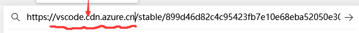
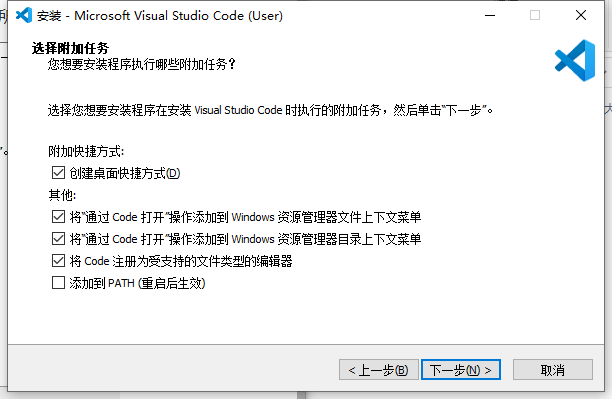
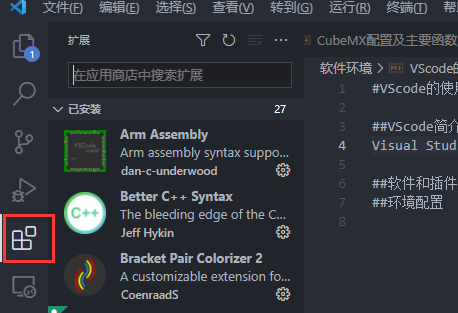
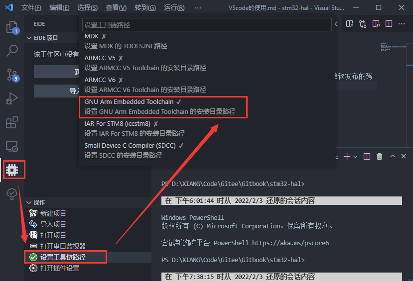
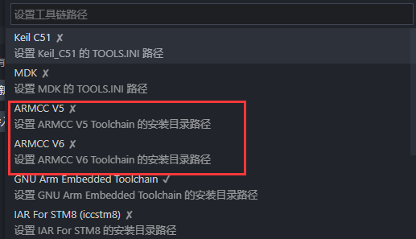

#VS code的使用

##VS code简介
Visual Studio Code（简称“VS Code”），是微软发布的跨平台源代码编辑器，在开源环境的依托下，VScode有大量第三方作者开发的插件。配合不同的插件可以编译不同语言的代码，也可以当做一些IDE嵌入式开发环境使用。以ST芯片的开发为例，一般是使用**MDK**或者**IAR**进行开发和调试，作为老一派的开发环境，这两个软件稳定性很高，编译的优化也很好。但是也因为其闭源付费使用的特性，这些软件对新功能的更新较慢，在诸如代码高亮补全等地方体验也不是很好，在一些商用场景也会有着版权的问题。

因此，为了提前适应之后不同环境的嵌入式开发，以及为了体验更好的编译开发环境。实验室的嵌入式开发（包括51和STM32）环境将以VS code为主，MDK的使用也会做一定的介绍，本章节会介绍VS code的安装和相应插件的使用。

##软件的安装

###获取VS code

VS code可以直接从[官网](https://code.visualstudio.com/)下载，选好正确的版本然后默认安装即可。有时候官网的下载速度很慢，也可以使用国内的镜像源进行下载，使用国内镜像源时将原本的下载链接中的部分段替换为如下地址：

`[vscode.cdn.azure.cn)      `

为了后续使用时方便**以文件夹的方式打开工程**，安装时记得勾选以下所有的选项：

###插件的安装

在如下图所示地方可以搜索安装自己想要的插件：

我们需要如下表格的插件

| 必备插件                | 说明                   |
| ----------------------- | ---------------------- |
| Chinese                 | 中文汉化               |
| C/C++                   | C语言编译的支持        |
| Embedded IDE            | 一个单片机编译环境支持 |
| **推荐插件**            |                        |
| Bracket Pair Color      | 括号分级彩色标注       |
| One Dark Pro            | 一个界面主题           |
| Prettier Code formatter | 代码格式化             |

##环境配置

在安装好Embedded IDE（简称EIDE）后，打开该插件会提示安装嵌入式的依赖环境，弹出的插件默认安装即可。在安装完成后开始配置**编译工具链**，我们这里使用GCC（GNU Arm Embedded Toolchain）编译工具链。打开插件后找到如下地方会提示**在线安装或者导入本地**，选择**在线安装（Online）**即可：

如果有**编译旧KEIL项目**的需求，可以按提示**导入MDK安装位置中的相应工具链**

而SDCC可以用于编译STC51项目，具体[参考此处]()

到此，进本插件的安装和基础环境的配置已经结束，具体开发时的工程主要依赖CubeMX创建，请参考[下一章节](CubeMX简介.md)
