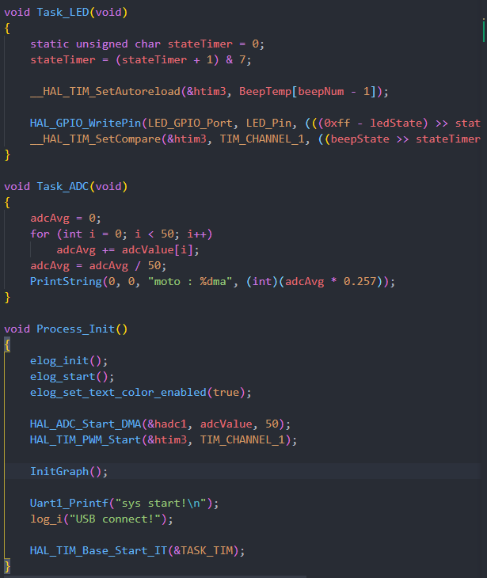

# 时间片原理简介

> [代码框架下载](https://wwo.lanzouy.com/ikDGZ00p1ixi)

在定时器简单中断程序的章节中，One more thing 那简单介绍了时间片的大概思路，但那个是一个随手写的代码，不够规整，可读性和拓展性都很差，并不适合应用在我们的实际项目中。因此我们最后了解一下时间片怎么写才好一些，又应该怎么用。

首先，我们回顾之前的程序结构，大概可以用以下的框图概括：


简单概括就是：在定时器中断中去计时判断并设置各个标志位，在主函数中依次判断标志位并运行其对应的任务以及清空标志位。整体的逻辑不算复杂，但是东西多了之后会很麻烦：有大量的运行标志和计数器需要我们手动装填，手动管理，这样不论是加入一个新的任务还是删除旧的任务都会很麻烦。

因此，我们需要善用循环处理，宏定义以及**结构体**。上文提到的每个任务对应的运行标志、计数器、运行间隔、重装间隔、对应的任务语句都可以用结构体的方式进行封装，可看下文。

# 代码概览

## 计时核心

首先，我们可以定义一个结构体，管理各个任务的计时，间隔时间，运行标志等：

```c
// 任务结构
typedef struct _TASK_COMPONENTS
{
    unsigned char Run;            // 程序运行标记：0-不运行，1运行
    unsigned short Timer;         // 计时器
    unsigned short ItvTime;       // 任务运行间隔时间
    void (*TaskHook)(void); // 要运行的任务函数
} TASK_COMPONENTS;          // 任务定义
```

在这里，每个进程对应的代码通过一个函数的指针封装，这样方便我们规范管理各个任务。

而之后便是最重要的计时处理部分，通常我们习惯以1ms为最小的运行时间单位，那么我们的计时程序可以放在一个1ms一次的定时器中断中，保证定时计数的准确运行。而计时部分也可以用宏定义和循环配合，方便我们更改：

```c
void TaskRemarks(void)
{
  for (uint8_t i = 0; i < TASKS_MAX; i++)
  {
    if (TaskComps[i].Timer)
    {
      TaskComps[i].Timer--;
      if (TaskComps[i].Timer == 0)
      {
        TaskComps[i].Timer = TaskComps[i].ItvTime;
        TaskComps[i].Run = 1;
      }
    }
  }
}
```

我们试着定义几个任务，比如20ms一次的OLED刷屏、1000ms的串口打印、125ms的LED闪烁、100ms的ADC取值······

```c
#define TASKS_MAX 4

static TASK_COMPONENTS TaskComps[] =
    {
        {0, 1, 20, Task_OLED_Upadata},
        {0, 1, 1000, Task_UART_Print},
        {0, 1, 125, Task_LED},
        {0, 1, 100, Task_ADC},
};
```

这样我们需要改各个任务的运行时间和任务数目就很方便了。需要注意的是，这里的计时器时间得填1或其他不为0的数，这是因为在`TaskRemarks()`标志计数函数中是先减一再判断是否定时到0的，如果填0会导致数据溢出以至于任务迟迟不能进行。

之后我们加入需要的头文件，增加一个方便后续修改的宏定义，并放到定时器中断中：

头文件和宏定义：

```c
#include "TimTask.h"
#include "MY_Process.h"//自己的进程头文件
#include "tim.h"
#define TASK_TIM htim1
```

定时器中断调用：

```c
void HAL_TIM_PeriodElapsedCallback(TIM_HandleTypeDef *htim)
{
  if (htim == (&TASK_TIM))
  {
    TaskRemarks();
  }
}

```

## 任务运行

完成了任务的计时，剩下的便是判断标志以及运行任务并在运行后清楚标志了。我们依旧是用循环和判断的方式：

```
void TaskProcess(void)
{
  for (uint8_t i = 0; i < TASKS_MAX; i++)
  {
    if (TaskComps[i].Run)
    {
      TaskComps[i].TaskHook();
      TaskComps[i].Run = 0;
    }
  }
}
```

而任务需要我们自己定义，通常是无返回值的函数。这里我们可以添加.c.h文件，在里面定义：

在`MY_Process.h`中定义各个时间片结构体中需要的函数，为方便管理，也定义一个统一的初始化函数：

```c
#include "main.h"

void Task_OLED_Upadata(void);
void Task_UART_Print(void);
void Task_LED(void);
void Task_ADC(void);

void Process_Init();
```

如我自己的任务是这样的：(每个人的代码不同，这里不放代码参考)

> **需要注意的是：初始化中用到的相应外设记得包含其对应的头文件**



在完成任务函数的编写后就大功告成了，接着我们在主函数中引用我们定义的头文件：

```c
/* USER CODE BEGIN Includes */
#include "TimTask.h"
#include "MY_Process.h"
/* USER CODE END Includes */
```

之后调用我们整合好的外设初始化函数，主函数里作循环判断运行：

```c
/* USER CODE BEGIN 2 */
  Process_Init();
  /* USER CODE END 2 */

  /* Infinite loop */
  /* USER CODE BEGIN WHILE */
  while (1)
  {
    TaskProcess();
    /* USER CODE END WHILE */

    /* USER CODE BEGIN 3 */
  }
```

确认无误就可以编译并下载验证了。

# 应用示例

> 以F401，主频84MHz为例，不同MCU记得更改对应的定时器计数值

## 配置时间片

新建一个工程，打开一个1ms一次的定时器中断：


配置自己需要的外设：(我自己用的，视自己需求设置)


生成代码，在工程中加入[时间片相应文件夹](https://wwo.lanzouy.com/ikDGZ00p1ixi)以及其他外设的文件夹：


定义自己的基准定时器，任务数目，任务运行参数：


添加相应的任务函数以及初始化函数，别忘了引用头文件：


在`My_Process.h`中定义任务：


别忘了修改自己任务数自己所用定时器：


之后主函数中：包含头文件→初始化任务进程→循环运行进程操作函数 即可，这里不再演示

