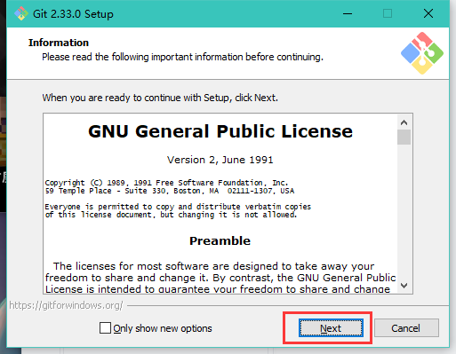
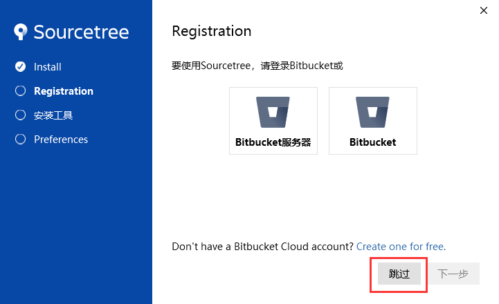
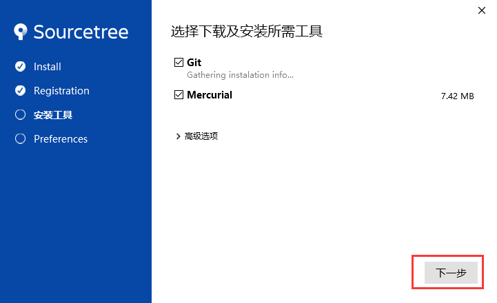
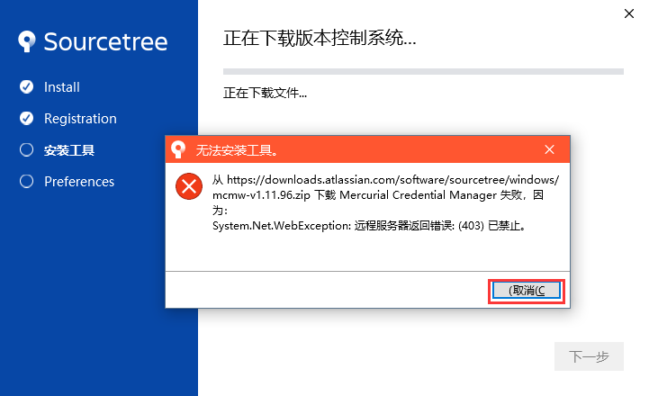

# Git简介

> 有了解想直接上手可以不看

为什么要使用Git，Git 又是个什么东东？

对于我们经常做一些小作品、项目的电子人来说，很多时候一整个项目并不是能直接一口气完成的，我们通常会把整个工程分为很多个部分，不仅是硬件上可以模块化设计，代码也可以。而对代码来说，版本迭代是一件很频发的事。将整个工程进度当做一条线的话，不同的完成进度就是线上的一个个节点。

这时候有个问题：我们通常开发不是一个顺利的过程，会经常遇到问题，有可能今天上午还能运行的一个程序，下午做了一些改动就突然运行不了了。要是改动少的话我们还可以靠着记忆力回退，改动多的话就只能祈祷代码有做保存能回到上午的版本了，要是也没保存就只能重新来过或者找个时光机了。

那随时保存总好了吧？的确是一个办法，但是保存多了自己分不清版本搞不清时间，还占了很大的一部分空间又不敢删除。并且，通常这样的工程代码想合作是一件困难的事情，你很难指望你的小伙伴能分得清你的进度到哪，每次干活还得先复制一个完整工程...那还是自己干吧。

而Git是一个版本管理软件，安装后你能使用命令窗写命令对你的工程进行存档，并且可以随时回退。有意思的是Git的保存方式是差异化保存，每次都保存增加删减的部分而已，这是不会占用而外的空间的。而Gitee是网页上的代码托管平台，可以在网页上创建一个仓库和电脑上的文件关联，网页上能随时看到本地提交的更新记录和变更内容，也能和小伙伴一起协作。

# 软件准备

我们实验室中目前是使用git配合SourceTree这个可视化软件使用，代码托管平台选择国内访问速度较快的gitee.com，所用的软件可以从官网或者从下方的云盘连接获取

- **Git：**[官网地址](https://git-scm.com/)  ， [2.33版本 云盘链接](https://wwo.lanzouy.com/iTh8qu0b4oj)  ,  密码：ct5k
- **SourceTree:** [官网地址](https://www.sourcetreeapp.com/)  ，[云盘链接](https://wwo.lanzouy.com/inUFOu0b31a)  ,  密码： hvkg
- **gitee官网：**gitee.com

## 安装Git

这里无脑下一步就好了,一路走到黑。（建议直接安装在C盘，方便后面软件自动识别git的路径）

## 安装SourceTree

>  几乎也是无脑下一步

不需要使用账号，直接跳过

软件自动识别在C盘中Git路径，如果在别的位置需自己导入一下

跳过这个警告

其余步骤不在演示了（忘记截图），而**最后一步是否添加秘钥选否**。

## 生成SSH秘钥

在任意文件夹右键打开git命令窗：

之后可以先输入 `git config --list`看看自己名字邮箱正确与否，如果没有可以用下面两个指令增改：

- `git config --global user.name “你的名字”`

- `git config --global user.email “你的邮箱”`

如下图：

然后使用   `SSH-keygen -t rsa -C “你的邮箱”`  生成SSH秘钥，这里需要按四次回车

（**稍作说明一下**：SSH秘钥相当于自己电脑的身份证，有了身份证才可以在网页gitee上进行身份认证，认证通过了才有权限管理仓库，换句话说，电脑的SSH泄露后每个人都可以在你的仓库上撒欢，因此不要随意告知别人自己的秘钥）

完成如下图：

其中包含了秘钥所在路径，用记事本打开如下文件，复制去其中所有内容，这串内容是你电脑的“身份证”

## 注册Gitee并添加秘钥

因为国内使用GitHub的速度较慢，体验不是很好，我们实验室使用国内的gitee代码托管平台，使用起来没太大差别，这个教程也可用于去克隆GitHub上优秀的代码。

首先我们打开官网，注册一个账号：https://gitee.com

注册完成后在点击如下的位置进入设置：

在如下位置打开自己的SSH公钥管理：

接着在如下地方添加自己电脑的名字，粘贴之前在记事本中复制的秘钥：

## 对SourceTree还有一些地方需要配置

打开SourceTree，也添加一下SSH公钥：

更改ssh客户端的类型后通常会自动定位SSH秘钥的位置，如果不正确也可以自行添加路径：

**到此，安装准备阶段完成。**

# Git的使用

## 创建一个远端仓库

在gitee网页上创建一个仓库，仓库名称自定义，一般以工程作名字：

> 仓库介绍这一块建议用心写一下，方便自己的管理，也可以通过修改设置模板中的readme.md文件中的内容进行修改，其他的根据实际情况勾选

仓库配置仅供参考：

完成后就能看到自己创建的仓库了：

## 仓库克隆

>  使用软件克隆仓库而不是下载仓库可以随时跟进仓库的每一次更新，也可看到现有的各个提交记录，比较方便我们的学习

克隆仓库通常需要一个SSH码，以我们新建的一个仓库为例，打开刚刚创建的仓库，复制仓库的SSH连接：

之后就可以利用SourceTree进行克隆，粘贴仓库SSH地址选择路径后克隆即可：

1. 第一行粘贴刚刚的ssh公钥

2. 第二行选择本地的路径，创建一个文件夹，通常文件夹与网上仓库名一致

完成克隆后点击master主分支就能看到各个节点：（新建仓库会有一个节点）

打开对应的文件夹也能看到相应的文件：

## 提交和推送

在克隆了自己远端仓库的基础上，我们随便抓个hello world进去（这里也可以丢一整个工程文件夹进去或者说对其中的文件进行一些内容的修改）：

之后打开SourceTree能开到这次的变化:

其中能看到未暂存的文件，我们可以把它暂存→提交，之后进行推送：

（在这里，如果是刚刚创建文件夹首次导入工程，我们直接点暂存所有即可；通常对于一个单片机工程来说，我们通常只上传改动的.c和.h文件即可；视情况而定）

**这里着重说明：**

下方的第一个红框是本次上传的提交日志，养成认真写提交日志的习惯可以方便我们对自己工程回顾，或者方便在我们多人协作时能看到不同人的进度。通常日志的格式是[提交类型]+

简单描述这次的提交内容/项目进度，如果需要详细说明则在换行后输入，如下：

完成提交后点击master就能看到提交的记录了：

网页上的仓库刷新后就能看到提交记录了：

每一次的提交记录都可以在这里看到：

## 分支及回退

### 概念简介：

在讲版本回退之前得先引入分支的概念：之前有提到，开发过程像是一根**有很多个节点的线**：

但有时候我们并不是独立一个去开发，或者一个人也可以并线开发：

在上面的演示图中表示了将一个项目分成了四个分支，可以互不干涉的开发，再合并。

当然也有可能一直向前走发现走不通想在某处 重新来过 的情况：

总的来说，我们可以借助git工具，让我们的项目工程随时存档，既方便我们做一个备份，也方便我们开发时的对比和记录。

## 分支

**在需要从某个地方重新开始时，可以利用分支功能在指定的的时间点创建一个分叉路口：**

> 先创建一个“分叉路口”：（在这点之后，右边文件夹会被创建，我们在创建前的版本弄一个“路口”）

确定检出：

并以这个路口为开始点创建一个分支：

创建后左边选择新分支后，在当前分支选项中就只看路口之前的日志了，同时右边对应的文件夹也不见了：

我们试着在分出的这条路上往前进→创建/更改文件并正常提交推送一次：
（这里我新建了Branch文件夹，里边随便放了个写了些数字的文本）

同样地写提交日志后提交并推送:

完成提交和推送后点击 所有分支就能看到两个“树杈”：

在网页上也能看到新的分支被建立，以及相应的提交记录：

在提交记录中可以翻到：

切换网页分支：

我们也可以随时切换分支，直接双击要切换到的分支即可：
（这里切换回主分支，相应文件夹出现）

到此，简单的分支操作和概念结束，分支合并操作会在后续教程版本更新。
不难发现，这样也是一种版本回退的方法，只不过这时的回退会引出新的分支，下面会介绍不产生新的分支的回退方法。

## 单次回退

有时候我们只是想回去烧录个代码，或者演示一下，就相当于是在路口停一下，不会往前走不需要创建一个新的分支。这时候我们直接双击想回退的版本就行了：
（同样以文件夹创建前的版本为例子）

这个时候会暂时创建一个HEAD分支在虚空，可以理解为在分支的路口驻留：

直接确定后我们能看到我们回溯到了文件夹创建之前，后续的日志也没了：

想要从“过去”回到“现在”时双击master主分支即可，驻留时的事均不保留：

接着又是“现在”的景象了:(回退内容到此结束)

## 多人合作

开始多人合作时需要给你的小伙伴分配个仓库的权限：

其中：
- 拥有者：可以开除管理员，删除仓库，老大哥；
- 管理员：拥有所有权限，可以编辑仓库，邀请成员；
- 开发者：可以编辑，但是不能邀请成员；
- 观察者：只能观察仓库，无权编辑。

## gitee上的拉帮结派

### 打开仓库中的管理选项：

点击添加仓库成员：

然后就可以以发送链接的方式邀请小伙伴一起开发了

PS ： 开始干活前记得拉去一下仓库，保持最新状态：

