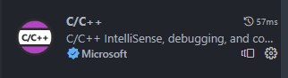
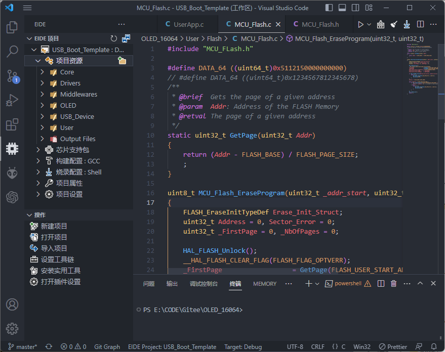
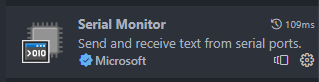
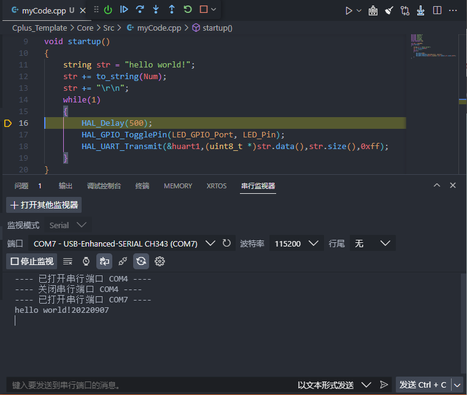
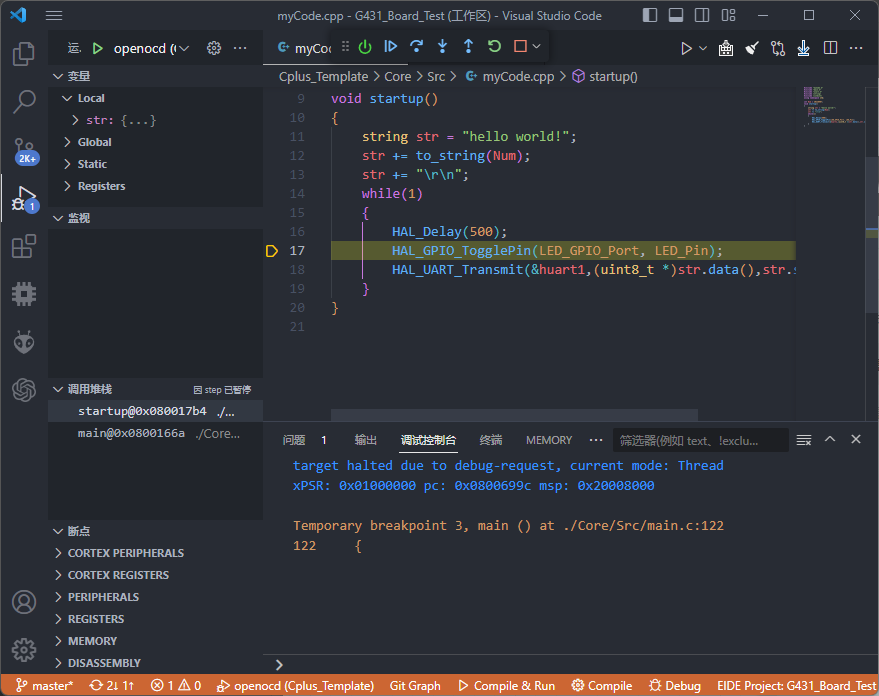

<h1 class="article-title">VScode插件分享</h1>

# 应用简介

VS Code，全称是 Visual Studio Code，是一个免费的、开源的跨平台编辑器。软件本身不是一个集成开发环境，但可以通过安装各种不同的插件以实现我们的需求。
具体的功能介绍可以参考连接：[功能大全](https://www.w3cschool.cn/vscode/)

## 界面功能

如上图：
1. 左侧：功能区，依次为文件浏览、查找、版本管理、运行调试、更多应用
2. 中间：主编辑窗，用于代码或文本的查看和编辑
3. 右侧：当前文件的缩略图，可以快速预览及定位，在版本管理下，有变更的代码会有的对应的颜色高亮
4. 下方：终端等窗口，为代码运行的输出端或其他插件的输出调试口

## 常用快键
快捷键可以通过上图中左下角标进行自定义设置，以下列举一些常用的插件和功能：

### 视图操作
| 快捷键 | 功能 |
| ------ | ------ |
| Ctrl + 滑轮 | 缩放(需要在设置中打开) |
| Ctrl + B | 切换侧边栏可见性 |
| Ctrl + J | 切换面板可见性 |

### 代码阅读
| 快捷键 | 功能 |
| ------ | ------ |
| Ctrl + P | 快速打开文件 |
| Ctrl + G | 跳转到行 |
| Ctrl + F | 查找当前文件 |
| Ctrl + Shift + F | 全局查找 |
| Ctrl + Shift + E | 打开资源管理器 |
| Alt + 方向键 | 向上或向下移动当前行 |
| Alt + Shift + 方向键 | 向上或向下复制当前行 |
| Alt + 鼠标拖拽 | 多行编辑 |
| F12 | 跳转到定义 |
| Alt + F12 | 小窗预览定义 |
| Ctrl + Tab | 切换最近打开的文件 |

### 代码编辑
| 操作类型 | 快捷键 | 功能简介 |
| ------ | ------ | ------ |
| 单行编辑| Ctrl + / | 添加、删除行注释 |
| 移动光标 | Ctrl + →/← | 光标向右/左移动至下一个单词的开头或结尾 |
| 移动光标 | Alt + →/← | 光标向右/左移动一个子单词至下一个单词的开头或结尾 |
| 移动光标 | Ctrl + ↑/↓ | 光标向上/下移动至上/下一行的相同位置 |
| 单行编辑 | Ctrl + L | 选择当前行 |
| 单行编辑 | Home/End | 光标移动至行首/尾 |
| 多行编辑 | Alt + Shift + ↑/↓ | 向上/下添加多行光标 |
| 多行编辑 | Ctrl + Shift + L | 为选中的每行添加多行光标（或取消多行光标） |
| 多行编辑 | Ctrl + Alt + ↑/↓ | 向上/下插入光标 |
| 选择字符 | 双击左键 | 选择当前单词 |
| 选择字符 | Ctrl + D | 快速选择相同的单词 |

## 插件安装

### 在线安装
在线能安装的插件一般不会出现什么问题，在**联网**条件下，直接打开左边"插件图标"，即可搜索安装相应的插件，插件默认安装C盘，请确保空间足够；

### 离线安装
在没有网络连接件时，可以考虑离线安装插件：

1. 下载插件：在另一台联网电脑上，通过 [VSCode插件市场](https://marketplace.visualstudio.com/)在线下载需要安装的插件，并将插件文件保存在本地。

2. 在本地安装插件：打开 VSCode 的扩展安装程序，点击菜单栏的“三个点”按钮，选择“从 VSIX 安装”选项，然后在弹出的文件选择对话框中选中之前下载的插件文件（VSIX 文件），点击“安装”按钮即可完成安装。

需要声明的是：

1. 部分插件和**VScode版本**可能存在冲突，需要在离线安装前确保插件可用。

2. 部分插件，在完成插件的安装后还会自行安装相应的数据包，离线安装时需要在完成插件安装后将数据包复制到此电脑的相应位置

# 基础插件

## C/C++

- **代码高亮**：支持 C++11、C++14、C++17、C11 等标准下的代码高亮。
- **语法检查**：支持基于 clangd 的语法检查、代码重构和快速自动补全，能准确识别并提示语法错误和潜在的错误。
- **调试器**：支持本地调试和远程调试，可以方便地设置断点、查看变量和调用堆栈，以更轻松地找到并解决问题。
- **自动代码补全**：自动补全功能可以根据你正在编写的代码补全函数、变量和其他语言结构。可以在代码编辑器中显示自动提示并使代码编辑更加高效。
- **调用层次结构**：该插件可以对你的代码进行状态分析，以可视化调用层次结构表格的形式呈现，方便你快速定位到目标函数和文件。
- **智能重构**：支持内联函数、提取变量、提取函数和重命名等智能重构操作，能够更容易地修改代码并保持正确性。
- **代码格式化**：该插件支持自动格式化和自定义代码格式化选项，可自动将代码格式化为所需格式。

## Chinese

- **中文输入法**：支持自动切换输入法和中英文状态。在输入中文时，插件还可以提示拼音候选字，方便用户输入法文。
- **中文路径转换**：可以将当前文件的路径自动转换为中文表述，方便在文件资源管理器中浏览非英语系统的文件夹路径。
- **中文字符转义**：支持将中文字符转换为 Unicode 编码或者 JavaScript 转义字符，方便代码中使用中文字符。
- **中文翻译**：支持单词和句子的翻译，可以在编辑器中进行操作，使用了云翻译 API，并且支持用户自定义云翻译服务商。

## One Dark Pro

主题美化类插件，改变主题色，及代码**高亮的颜色**

## Prettier - Code formatter

Prettier - Code formatter 插件是一个用于格式化代码的 VSCode 插件，具有以下功能：

- **自动格式化**：一旦安装了 Prettier 插件，它就会自动为你格式化代码，避免了手动调整代码格式的繁琐操作。
- **支持多种语言**：Prettier - Code formatter 插件支持多种编程语言，如 JavaScript、TypeScript、JSON、CSS、SCSS、LESS、HTML、Vue.js、React 等。
- **支持自定义配置**：Prettier 插件提供了丰富的配置选项，让用户可以根据自己的偏好来设置代码格式化规则，如单行代码长度、缩进、换行符等等。
- **统一的代码风格**：Prettier 可以帮助团队中的开发人员统一代码风格，减少了代码风格不一致造成的困扰，提升了代码质量。

# 编程辅助

## Git Graph

- **可视化展示 Git 历史记录**：Git Graph 可以将 Git 仓库的提交记录以关系图的形式展示出来，让用户直观、清晰地了解项目的 Git 历史记录。
- **简单易用的 UI 界面**：Git Graph 的用户界面简洁、易用，可以通过展示提交记录和分支图来让用户真正理解 Git 的工作原理。
- **支持多种 Git 命令**：Git Graph 支持多种 Git 命令，例如 Git Merge 和 Git Rebase 等，让用户可以在单个 UI 界面中通过点击完成相关 Git 操作。

## Markdown preview

Markdown Previe 是一款功能强大的预览 Markdown 文件的插件，在编写技术文档、博客等方面具有很高的实用性：

- **实时预览**：插件可以实时预览 Markdown 文件，让用户可以在编辑器中直接看到最终的渲染效果。
- **支持多种语法**：Markdown Preview 支持多种 Markdown 语法，包括标题、列表、链接、代码框等，方便用户编辑 Markdown 文件。
- **多种主题**：该插件支持多种主题，用户可以从中选择自己喜欢的主题来渲染 Markdown 文件。
- **支持 PDF 导出**：用户可以通过插件将 Markdown 文件导出为 PDF 格式文件，方便用户进行打印或分享。

## TODO Highlight

用于高亮**TODO**

# 嵌入式开发

## EIDE

EIDE (Embedded IDE) 是一款专门为嵌入式软件开发定制的 VSCode 插件，具有以下特点：

- **支持多种嵌入式平台**：EIDE 支持多种嵌入式平台，如 STM32、ESP-IDF、Arduino、Raspberry Pi 等，便于开发人员进行针对不同嵌入式平台的软件开发。
- **支持多种编程语言**：该插件支持多种编程语言，如 C/C++、Python、Assembly 等，覆盖了嵌入式软件开发中常用的语言。
- **支持硬件调试**：EIDE 集成了一些调试工具，可以方便地进行硬件调试和单步调试等操作。
- **支持串口通信**：早些版本中插件支持串口通信，并提供了串口监视器，方便用户进行调试和输出调试信息。
- **自定义工具链**：EIDE 提供了一个灵活的配置界面，可以方便地配置工具链和各种构建链接选项等。
- **其他特点**：还有一些其他特点，如跨平台支持、代码片段管理、智能代码审查等。、

需要注意的是，该插件在安装完成后需要联网继续下载支持库相关内容，离线安装时需要复制支持库

## PlatformIO IDE

PlatformIO IDE 是一款专门为嵌入式开发的包管理器和 IDE 工具，目的是支持开源硬件项目的全流程，多用于Arduino项目的开发，具有以下特点：

- **支持众多的开源硬件平台**：PlatformIO 支持多种嵌入式硬件开发平台，例如 Arduino、Atmel AVR、Espressif ESP32 和 ESP8266、ST STM32、Nordic nRF51 和 nRF52、Texas Instruments MSP430 和 Tiva C 等。
- **集成了兼容的编译器和调试器**： PlatformIO 中包含了多个开源的编译器和调试器，包括 GCC、Clang、GDB 和 OpenOCD 等，可以为用户提供强大的编译和调试支持。
- **自带了丰富的代码库**：PlatformIO 中有一系列的代码库，包括 Arduino 库、CMSIS 库、FreeRTOS 库等等，用户可以快速地在自己的项目中使用它们。
- **智能配置项目**： PlatformIO 掌握了正确的编译框架，根据硬件平台和操作系统，自动推荐合适的编译环境和平台，方便用户配置项目。
- **命令行工具支持**：除了安装 IDE 插件，用户也可以选择直接安装 PlatformIO 命令行工具，并在命令行工具中使用 PlatformIO 的所有功能。
- **其他特点**：自动义发布和版本管理、代码嵌入、调用栈分析、交叉平台支持等等。

## Serial Monitor

Serial Monitor 是一款用于查看串口通信数据的 VSCode 插件，具有以下特点：

- **实时查看串口数据**：安装 Serial Monitor 后，用户可以通过插件实时地查看串口数据，包括 ASCII 字符、二进制数据等。
- **多种串口参数支持**：该插件支持多种串口参数设置，如波特率、校验位、数据位和停止位等。
- **支持多种编码格式**：Serial Monitor 支持多种编码格式，包括 ASCII、UTF-8、GBK 等。
- **支持高亮显示关键字**：用户可以设置关键字并对其进行高亮显示，方便用户快速定位关键信息。
- **支持保存数据**：用户可以将串口数据保存为文件，方便后续分析和处理。
- **支持多操作系统**：Serial Monitor 插件支持多种操作系统，如 Windows、macOS 和 Linux 等。
  

## Cortex-Debug

Cortex-Debug 是一款支持 Cortex-M 微控制器调试的 VSCode 插件，具有以下特点：

- **支持多种 ARM 架构**：Cortex-Debug 支持多种 ARM 架构，包括 Cortex-M0、Cortex-M0+、Cortex-M3、Cortex-M4、Cortex-M7 等等，几乎覆盖了所有 Cortex-M 微控制器类型。
- **支持 JTAG 和 SWD 接口**：该插件支持 JTAG 和 SWD 接口，可以直接连接到目标设备进行调试。
- **支持单步调试**：用户可以对目标设备进行单步调试，支持单条指令、断点、观测点等。
- **支持内存查看**：用户可以直接查看目标设备的内存空间，包括数据、全局变量、堆栈等内容。
- **支持寄存器查看**：用户可以查看目标设备的寄存器，包括通用寄存器、特殊功能寄存器等。
- **其他特点**：支持断点条件、变量查看、快速调试等等。

